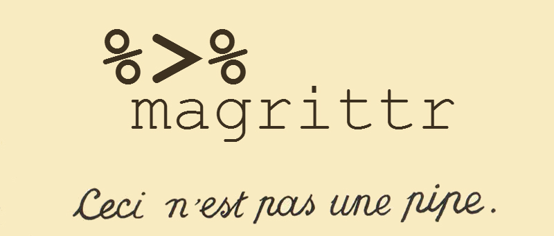

<!--
%\VignetteEngine{knitr}
%\VignetteIndexEntry{Introduction to dplyr}
-->




*February, 2014. Stefan Milton Bache* 

This introduction to *the magrittr* (very important: this is to be pronounced
with a sophisticated french accent) will be short(*ish*) and to the point; 
as is the package itselt. *magrittr* has two aims: to decrease development time and
to improve readability and maintainability of code. Or even shortr: to make
your code smokin' (puff puff)!

To archive its humble aims, *magrittr* (remember the accent) provides a new 
"pipe"-like operator, `%>%`, with which you may pipe a value forward into an 
expression or function call; something along the lines of ` x %>% f `, rather
than ` f(x)`. This is not an unknown feature
elsewhere; a prime example is the `|>` operator used extensively in `F#`
(to say the least) and indeed this served as a motivation for developing 
the magrittr package.

At first encounter, you may wonder whether such an operator can really 
be all that beneficial; but as you may notice, it semantically changes your 
code in a way that makes it both more intuitive to write and read.

Consider the following example, in which the `airquality` dataset shipped with
R is aggregated by week. We also print the first 3 rows for exposition.

```r
library(magrittr)

weekly <-
  airquality %>% 
  transform(Date = paste(1973, Month, Day, sep = "-") %>% as.Date) %>% 
  aggregate(. ~ Date %>% format("%W"), ., mean)

weekly %>% head(3)
```

```
  Date %>% format("%W") Ozone Solar.R   Wind  Temp Month  Day Date
1                    18 26.75   192.5  9.875 68.75     5  2.5 1218
2                    19 15.40   192.6 12.280 64.00     5  9.8 1225
3                    20 18.14   203.4 12.457 63.29     5 17.0 1232
```

We start with the value `airquality` (a `data.frame`). Then based on this, we 
make the "transformation" of adding a `Date` column using month, day and 
year (the year can be found in the dataset's documentation). Then we 
aggregate the data by week, which is a "format"" of the date, and
we use the `mean` function as aggregator. Note how the code is arranged in the logical
order of how you think about the task: data->transform->aggregate.
A horrific alternative would be to write

```r
weekly <- aggregate(. ~ format(Date, "%W"), transform(airquality, 
  Date = as.Date(paste(1973, Month, Day, sep = "-"))), mean)

head(weekly, 3)
```

```
  format(Date, "%W") Ozone Solar.R   Wind  Temp Month  Day Date
1                 18 26.75   192.5  9.875 68.75     5  2.5 1218
2                 19 15.40   192.6 12.280 64.00     5  9.8 1225
3                 20 18.14   203.4 12.457 63.29     5 17.0 1232
```

There is a lot more clutter with parentheses and the mental task of deciphering
the code is more challenging---in particular if you did not write it.
Note how even the extraction of a first few rows has a semantic appeal in the
first example over the second, even though none of them are hard to understand.
Granted: you may make the second example better, perhaps throw in a few temporary
variables (which is often avoided to some degree when using *the magrittr*),
but one often sees cluttered lines like the ones presented. 

And here is another selling point. Suppose I want to quickly go a step further and 
extract a subset somewhere in the process:

```r
windy.weeks <-
  airquality %>% 
  transform(Date = paste(1973, Month, Day, sep = "-") %>% as.Date) %>% 
  aggregate(. ~ Date %>% format("%W"), ., mean) %>%
  subset(Wind > 12, c(Ozone, Solar.R, Wind)) %>% 
  print
```

```
  Ozone Solar.R  Wind
2 15.40   192.6 12.28
3 18.14   203.4 12.46
7 27.00   207.7 14.53
```

I will refrain from making the alternative mess even messier, but it should be 
clear that adding steps in a *magrittr* chain is simpler than working ones
way through a labyrinth of parentheses.

The combined example shows a few neat features of the pipe (which it is not):

1. As default the left-hand side (LHS) will be *piped in* as the first argument of 
the function appearing on the right-hand side. This is the case in the `transform`
expression.
2. It may be used in a nested fashion, e.g. appearing in expressions within 
arguments. This is used in the date conversion (Note how the "pronounciation"
of e.g. `"2014-02-01" %>% as.Date` is more pleasent than is `as.Date("2014-02-01")`).
3. When the LHS is needed somewhere else than as the first argument, one can use
the dot,`'.'`, as placeholder. This is used in the `aggregate` expression.
4. The dot in e.g. a formula is *not* confused with a placeholder, which is
utilized in the `aggregate` expression.
5. Whenever only *one* argument is needed, the LHS, then one can omit the
empty parentheses. This is used in the call to `print` (which also returns its
argument). Here, `LHS %>% print()`, or even `LHS %>% print(.)` would also work.

One feature, which was not utilized above is piping into *anonymous functions*.
This is also possible, e.g.

```r
windy.weeks %>%
function(x) rbind(x %>% head(1), x %>% tail(1))
```

```
  Ozone Solar.R  Wind
2  15.4   192.6 12.28
7  27.0   207.7 14.53
```


To summarize the important features:

1. Piping defaults to first-argument placement.
2. Using a dot as placeholder allows you to use the LHS anywhere on the 
  right-hand side.
3. You may omit parentheses when only the LHS is needed as argument.
4. You can use anonymous functions.

In addition to the `%>%`-operator, *magrittr* provides some aliases for other
operators which make operations such as addition or mulitplication fit well 
into the *magrittr*-syntax. As an example, consider:

```r
rnorm(1000)    %>%
multiply_by(5) %>%
add(5)         %>%
function(x) 
  cat("Mean:",     x %>% mean, 
      "Variance:", x %>% var,  "\n")
```

```
Mean: 4.719 Variance: 24.78 
```

which could be written in more compact form as

```r
rnorm(100) %>% `*`(5) %>% `+`(5) %>% 
function(x) cat("Mean:", x %>% mean, "Variance:", x %>% var,  "\n")
```

To see a list of the aliases, execute e.g. `?multiply_by`. To see more
examples of `%>%` use, see development page: 
[github.com/smbache/magrittr](http://github.com/smbache/magrittr).
